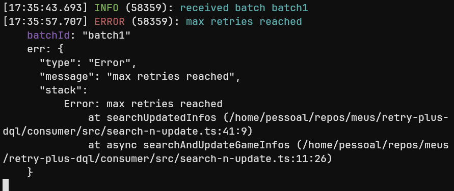
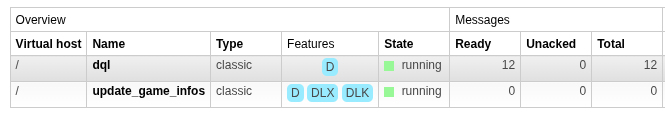

# Exemplo de Dead Letter Queue com RabbitMQ

Este é um projeto de exemplo que demonstra a implementação de uma Dead Letter Queue (DLQ) usando RabbitMQ e Node.js. O objetivo principal é mostrar como lidar com mensagens que falham durante o processamento em um sistema de mensageria.

## Objetivo

Demonstrar uma implementação prática de DLQ (Dead Letter Queue) em um cenário real, onde mensagens que falham após múltiplas tentativas são redirecionadas para uma fila específica para análise posterior.

## Contexto de Negócio

Para demonstrar o uso da DLQ, utilizei a ideia de um sistema simples que atualiza informações de jogos:
- Periodicamente, verifica jogos que precisam ser atualizados
- Tenta buscar novas informações desses jogos
- Em caso de falhas (por exemplo, API externa indisponível), a mensagem passa pelo processo de retry
- Após exceder o número máximo de tentativas, a mensagem é enviada para a DLQ

## Implementação

1. **Retry Pattern**
    - Implementação de retry com exponential backoff
    - Redirecionamento automático para DLQ após exceder tentativas

## Arquitetura

O projeto é dividido em dois serviços principais:

### Producer Service
- Responsável por iniciar o processo de atualização
- Gera tasks periódicas para verificar jogos que precisam ser atualizados
- Envia mensagens para a fila de processamento

### Consumer Service
- Processa as mensagens de atualização
- Realiza as requisições para buscar informações atualizadas
- Atualiza a base de dados com as novas informações

## Tecnologias Utilizadas

- **TypeScript**: Linguagem principal
- **RabbitMQ**: Message-broker
- **Biome**: Formatação e linting de código
- **Docker Compose**: Conteinerização do RabbitMQ


## Como Executar

1. **Inicie o RabbiMQ**
```bash
docker-compose up -d
```
2. **Instale as dependências**
```bash
cd producer && npm i
cd ../consumer && npm i
```

3. **Inicie os serviços**
```bash
cd producer && npm run dev
cd consumer && npm run dev
```

## Conclusão

Em sistemas que utilizam comunicação assíncrona é fundamental se preocupar com a implementação pelos seguintes motivos:

1. **Resiliência**
   - O sistema precisa ser capaz de se recuperar de falhas
   - Garantia de que nenhuma atualização será perdida
   - Capacidade de lidar com indisponibilidade temporária de serviços

2. **Consistência de dados**
   - Evitar atualizações duplicadas
   - Manter a integridade das informações

3. **Manutenibilidade**
   - Código organizado e bem estruturado
   - Fácil identificação e correção de problemas

4. **Observabilidade**
   - Rastreamento completo das operações
   - Capacidade de auditar o processo
   - Identificação rápida de gargalos ou problemas

> Erro disparado e encaminha para DLX



> DLQ com bind na DLX


